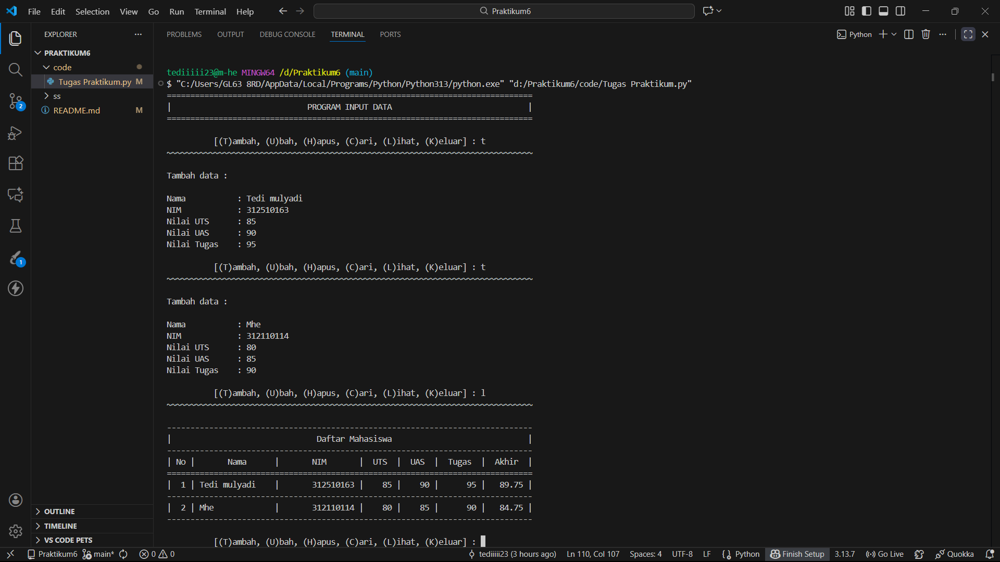

# Praktikum 6  

|  |  |
| -------- | --- |
| **Nama** | Tedi Mulyadi |
| **NIM** | 312510163 |
| **Kelas** | TI.25.A2 |
| **Mata Kuliah** | Pengantar Pemrograman |
| **Dosen** | Agung Nugroho, S.Kom., M.Kom. |  

## Latihan 1  
•   Ubah kode dibawah ini menjadi fungsi menggunakan  lambda  
```python
import math

def a(x):
    return x**2

def b(x, y):
    return math.sqrt(x**2 + y**2)

def c(*args):
    return sum(args)/len(args)

def d(s):
    return "".join(set(s))
```  
•   Berikut adalah kode hasil konversi semua fungsi menjadi bentuk lambda  
```python
import math

# Fungsi a(x): mengembalikan x pangkat 2
a = lambda x: x**2

# Fungsi b(x, y): mencari jarak (rumus pitagoras)
b = lambda x, y: math.sqrt(x**2 + y**2)

# Fungsi c(*args): menghitung rata-rata
c = lambda *args: sum(args) / len(args)

# Fungsi d(s): menghapus huruf yang sama, lalu menggabungkannya
d = lambda s: "".join(set(s))


# Contoh penggunaan
print(a(5))           # 25
print(b(3, 4))        # 5.0
print(c(2, 4, 6, 8))  # 5.0
print(d("banana"))    # 'ban' (urutan bisa berbeda karena set)
```  
## Penjelasan  
------------------------------------------------------------------------ 

a = lambda x: x**2  

***Lambda ini sama seperti fungsi:*** 

``` python
def a(x):
    return x**2
```  

Artinya:  

- Mengembalikan nilai x kuadrat.  

------------------------------------------------------------------------ 

b = lambda x, y: math.sqrt(x**2 + y**2)  

***Sama seperti fungsi:***  

``` python
def b(x, y):
    return math.sqrt(x**2 + y**2)
```  

Digunakan untuk menghitung:  

- Akar dari (x² + y²) → rumus jarak pitagoras.  
------------------------------------------------------------------------ 

c = lambda *args: sum(args) / len(args)  

***Sama seperti:***  

``` python
def c(*args):
    return sum(args) / len(args)
```  
Artinya:  

- Mengambil banyak angka lalu menghitung rata-rata.  

Contohnya:   

- c(2, 4, 6, 8) → (2+4+6+8) / 4 = 20/4 = 5  
------------------------------------------------------------------------ 

d = lambda s: "".join(set(s))  

***Sama seperti:***  

```python  
def d(s):
    return "".join(set(s))
```

Artinya:  

- Menghapus huruf duplikat dari sebuah string.
- Lalu menggabungkannya kembali jadi satu kata.  

Contohnya:  

- d("banana") → "ban" (urutan bisa acak karena set)  
------------------------------------------------------------------------ 

## Tugas Praktikum  
*Buat program sederhana dengan mengaplikasikan penggunaan fungsi
yang akan menampilkan daftar nilai mahasiswa, dengan ketentuan:*
- Fungsi tambah() untuk menambah data
- Fungsi tapilkan() untuk menampilkan data
- Fungsi hapus(nama) untuk menghapus data berdasarkan nama
- Fungsi ubah(nama) untuk mengubah data berdasarkan nama
- Buat flowchart dan penjelasan programnya pada README.md  

------------------------------------------------------------------------ 

## Flowchart  


## Program 
``` Python
list = {}

def garis():
    '''Fungsi garis'''
    print("~"*80)

    # Menambahkan data inputan 
def tambah():
    print("Tambah data :\n")
    nama    = input("Nama           : ")
    nim     = int(input("NIM            : "))
    uts     = int(input("Nilai UTS      : "))
    uas     = int(input("Nilai UAS      : "))
    tugas   = int(input("Nilai Tugas    : "))
    akhir = (tugas * 30/100) + (uts * 35/100) + (uas * 35/100)
    list[nama] = [nim, tugas, uts, uas, akhir]

    # Mengubah data inputan
def ubah():
    print("Ubah Data :")
    nama = input("\nMasukkan Nama  : ")
    if nama in list.keys():
        nim     = int(input("NIM            : "))
        uts     = int(input("Nilai UTS      : "))
        uas     = int(input("Nilai UAS      : "))
        tugas   = int(input("Nilai Tugas    : "))
        akhir = (tugas * 30/100) + (uts * 35/100) + (uas * 35/100)
        list[nama] = [nim, tugas, uts, uas, akhir]
    else:
        print("NAMA {0} TIDAK ADA!".format(nama))

    # Menghapus inputan Nama
def hapus():
    print("Hapus berdasarkan nama inputan :")
    nama = input("\nMasukkan Nama  : ")
    if nama in list.keys():
        del list[nama]
        print("\nData {0} berhasil di hapus".format(nama))
    else:
        print("NAMA {0} TIDAK ADA!".format(nama))
    
    # Mencari data yg sudah di input
def cari():
    print("Cari data berdasarkan nama inputan :")
    nama = input("\nMasukkan Nama : ")
    if nama in list.keys():
        print(f"\nNama        : {nama}")
        print(f"NIM         : {list[nama][0]}")
        print(f"Nilai UTS   : {list[nama][2]}")
        print(f"Nilai UAS   : {list[nama][3]}")
        print(f"Nilai Tugas : {list[nama][1]}")                  
        print(f"Nilai Akhir : {list[nama][4]}") 
    else:
        print("NAMA {0} TIDAK ADA!".format(nama))
    
    # Menampilkan seluruh data 
def lihat():
    if list.items():
        print("-"*78)
        print("|                               Daftar Mahasiswa                             |")
        print("-"*78)                 
        print("| No |       Nama      |       NIM       |  UTS  |  UAS  |  Tugas  |  Akhir  |")
        print("="*78)
        i = 0
        for data in list.items():
            i += 1
            print("| {no:2d} | {0:15s} | {1:15d} | {2:5d} | {3:5d} | {4:7d} | {5:7.2f} |"
                .format(data[0][:13], data[1][0], data[1][2], data[1][3], data[1][1], data[1][4], no=i))
            print("-"*78)
    else:
        print("-"*78)
        print("|                               Daftar Mahasiswa                             |")
        print("-"*78)
        print("|No. | Nama            |       NIM       |  UTS  |  UAS  |  Tugas  |  Akhir  |")
        print("-"*78)
        print("|                       TIDAK ADA DATA! Silakan tambah data                  |")
        print("-"*78)


print("="*78)
print("|                  PROGRAM INPUT DATA                  |")
print("="*78)

while True: 
    print()
    menu = input("          [(T)ambah, (U)bah, (H)apus, (C)ari, (L)ihat, (K)eluar] : ")
    print("~"*75)
    print()

    if menu.lower() == 't':
        tambah()

    elif menu.lower() == 'u':
        ubah()       

    elif menu.lower() == "h":
        hapus() 

    elif menu.lower() == "c":
        cari()

    elif menu.lower() == "l":
        lihat() 

    elif menu.lower() == "k":
        print("Program selesai, Terima Kasih :) ")
        break

    else:
        print("\n INPUT {} TIDAK ADA!, Silakan pilih [T/U/H/C/L] untuk menjalankan program!".format(menu))
```
### Penjelasan
Pada dasar nya program ini sama seperti Praktikum5, bedanya di program ini di tambahkan `Function` / Sub rutin. 
Seperti program ada di atas `def` yg berati definision, & contoh `def garis()` Untuk membuat fungsi garis yg di panggil dari `print("~"*78)`.

Kalau `def tambah()`, `def ubah()`, `def hapus()`, `def cari()`, `def lihat()` di panggil dari program berikut :
``` Python
while True: 
    print()
    menu = input("[(T)ambah, (U)bah, (H)apus, (C)ari, (L)ihat, (K)eluar] : ")
    print("~"*75)
    print()

    if menu.lower() == 't':
        tambah()

    elif menu.lower() == 'u':
        ubah()       

    elif menu.lower() == "h":
        hapus() 

    elif menu.lower() == "c":
        cari()

    elif menu.lower() == "l":
        lihat() 

    elif menu.lower() == "k":
        print("Program selesai, Terima Kasih :) ")
        break

    else:
        print("\n INPUT {} TIDAK ADA!, Silakan pilih [T/U/H/C/L] untuk menjalankan program!".format(menu))
```

### Hasil Program 

